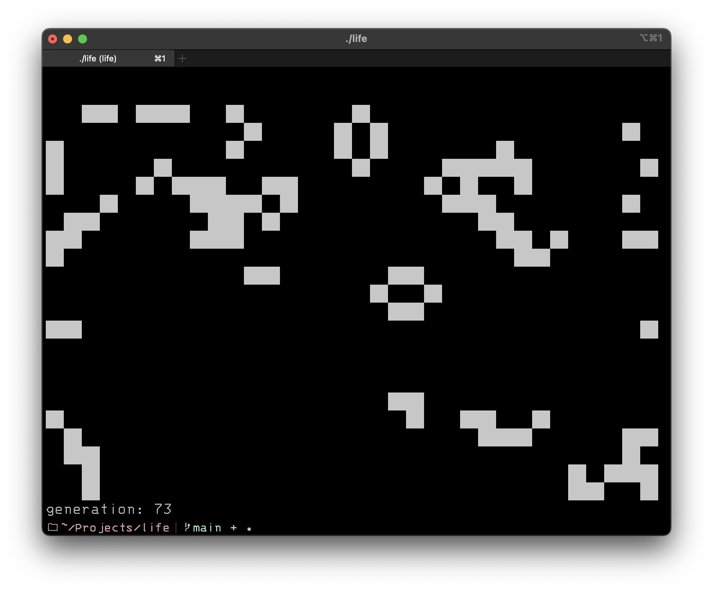

# Life

Just another Game of Life - because why not?



A terminal-based Conway's Game of Life implementation. Watch pixels live, die, and evolve right in your console.

**Caution:** May lead to existential contemplation about pixels.

## Usage

```bash
go run main.go
```

Press `^c` to quit when you've had enough of watching digital evolution unfold.

